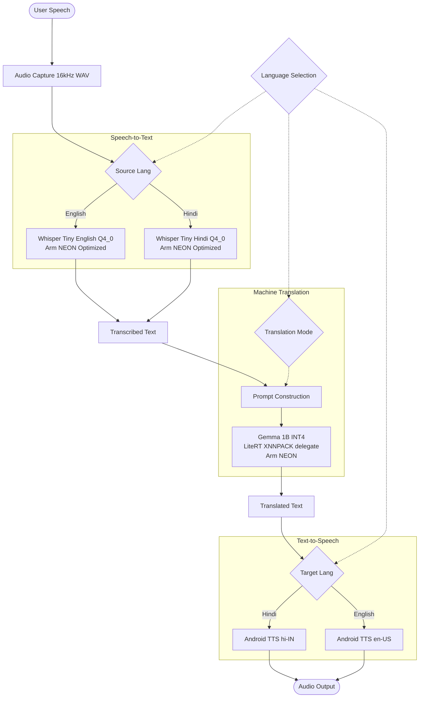

# System Architecture and Data Flow

This document outlines the architecture and data flow of the Voice Translator application, highlighting how the application leverage on-device AI and Arm optimizations.

## Data Flow Pipeline

The application follows a continuous pipeline, transforming spoken audio into translated speech entirely on the device.

1.  **Audio Capture (Input)**
    *   The user taps the microphone button.
    *   The `record` Flutter package captures audio from the device microphone.
    *   Audio is recorded as a 16kHz mono WAV file to a temporary directory.

2.  **Speech-to-Text (STT) - OpenAI Whisper**
    *   When recording stops, the WAV file path is passed to the `STTService`.
    *   The service invokes the `WhisperChannel` (a MethodChannel).
    *   The native Android layer (Kotlin/JNI) passes the audio data to the C++ `whisper.cpp` engine.
    *   The Whisper Tiny model (quantized to Q4_0) processes the audio and returns the transcribed text.

3.  **Machine Translation (MT) - Google Gemma**
    *   The transcribed text is passed to the `TranslationService`.
    *   The service constructs a prompt enforcing a strict translation output.
    *   The prompt is fed to the Gemma 1B INT4 model using MediaPipe's LiteRT API via the `flutter_gemma` package.
    *   The model generates the translated text.

4.  **Text-to-Speech (TTS) - Native Android output**
    *   The translated text is passed to the `TTSService`.
    *   The service configures the native Android Text-to-Speech engine with the target language.
    *   The translated text is synthesized and played through the device speaker.

## Model Choices & The Arm Connection

The selection of models and the execution environment are heavily optimized for mobile devices, specifically targeting Arm v8 architectures.

### Gemma 1B INT4 (Translation)
*   **Why Gemma?** Google's Gemma models offer state-of-the-art performance for their size. The 1B parameter model provides a good balance between translation quality and resource requirements.
*   **Why INT4 Quantization?** Memory bandwidth is a primary bottleneck for LLM inference on mobile SoCs. Quantizing the model weights to 4-bit integers (INT4) drastically reduces the memory footprint (from ~4GB to ~1GB) and memory bandwidth requirements, allowing the model to run efficiently on mobile.
*   **The Arm Connection:** We use the **LiteRT XNNPACK delegate** for inference. XNNPACK is highly optimized for Arm processors, utilizing **Arm NEON SIMD (Single Instruction, Multiple Data)** instructions. This allows parallel execution of the heavy matrix multiplication operations required by the LLM, significantly accelerating inference speed on the CPU/GPU.

### Whisper Tiny Q4_0 (Speech Recognition)
*   **Why Whisper Tiny?** The 'Tiny' model provides sufficient accuracy for clear dictation while being extremely small (~70MB) and fast.
*   **Why Q4_0 Quantization?** Similar to Gemma, 4-bit quantization reduces memory bandwidth usage.
*   **The Arm Connection:** The `whisper.cpp` implementation is compiled with NEON support. The C++ backend directly leverages these SIMD instructions to accelerate the STT process, ensuring ultra-low latency transcription necessary for a real-time conversational experience.
